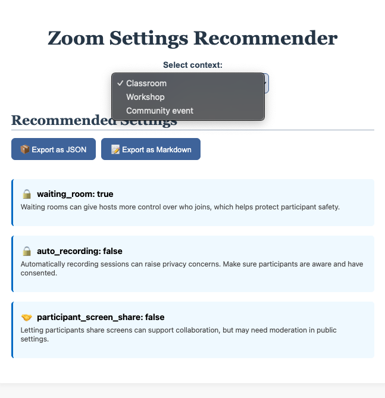

# Zoom Settings Recommender

A privacy- and equity-focused tool that recommends Zoom configuration presets based on the intended use context (e.g., classroom, workshop, support group).

## Why This Matters

Educators and facilitators often face unclear or overwhelming Zoom configuration menus. This tool aims to demystify and surface key settings that support:

- Participant safety and privacy  
- Accessibility for learners with diverse needs  
- Equity and inclusive engagement

Built to reflect values aligned with critical pedagogy: empowerment, consent, and access.

## Features

- Context-aware setting profiles (e.g., Classroom, Office Hours, Support Group)
- Clear “Why this matters” insight for each setting
- Export settings as:
  - JSON for programmatic use  
  - Markdown for readable documentation or sharing
- Friendly, educator-centered UI


## Getting Started

```bash
npm install
npm start
````

Then open: [http://localhost:3000](http://localhost:3000)

## Technology Stack

* React
* JSON-based configuration engine
* Custom CSS (accessible and mobile-friendly)
* No tracking or analytics

## File Structure

```
src/
├── data/
│   ├── presets.json             # Settings grouped by use-case
│   ├── explanation_map.json     # Human-readable “why” insights
│   └── setting_categories.json  # Visual tags for equity/privacy/access
├── App.js                       # Main React component
├── App.css                      # Styling
└── index.js
```


